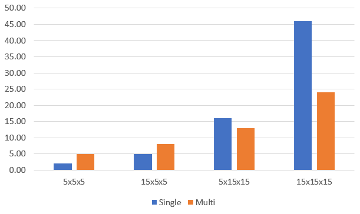


[](https://github.com/asc-community/GenericTensor/blob/master/LICENSE)
[](https://discord.gg/YWJEX7a)
[](https://www.nuget.org/packages/GenericTensor/)
[](https://github.com/asc-community/GenericTensor/tree/master/UnitTests)

# GenericTensor


It is the only fully-implemented generic-tensor library for C#. Allows to work with tensors of custom types.

Tensor - is an extentension of matrices, a N-dimensional array. Soon you will find all common functions that are
defined for matrices and vectors here. In order to make it custom, Tensor class is generic, which means that
you could use not only built-in types like int, float, etc., but also your own types.

### Installation

GT is available on [Nuget](https://www.nuget.org/packages/GenericTensor/).

### How do I work with GenericTensor?

To make your type work correctly, you first should implement a struct that inherits from `IOperations` or take an existing one
for built-in types.

#### Hello world

Let's create a float matrix `3 x 3` and multiply by itself.

```cs
var myMatrix = GenTensor<float, FloatWrapper>.CreateMatrix(
    new float[,]
    {
        {1, 2, 3},
        {4, 5, 6},
        {7, 8, 9}
    }
);

var multiplied = GenTensor<float, FloatWrapper>.MatrixMultiply(myMatrix, myMatrix);

Console.WriteLine(multiplied);
```

Now we are going to unite a few such matrices into tensor:

```cs
var t = GenTensor<float, FloatWrapper>.Stack(myMatrix, myMatrix);
```

And swap the first and the last axis and output it

```cs
t.Transpose(0, 2);
Console.WriteLine(t);
```

Check already defined wrappers <a href="https://github.com/asc-community/GenericTensor/blob/master/GenericTensor/Functions/DefaultWrappers.cs">here</a>.

#### Custom type

If you need custom type for your needs, you have to implement a `struct` that is inherited from `IOperations<T>`, where
T - is your type. There is an example for ints:

```cs
public struct IntWrapper : IOperations<int>
{
    public int Add(int a, int b) => a + b;
    public int Subtract(int a, int b) => a - b;
    public int Multiply(int a, int b) => a * b;
    public int Negate(int a) => -a;
    public int Divide(int a, int b) => a / b;
    public int CreateOne() => 1;
    public int CreateZero() => 0;
    public int Copy(int a) => a;
    public bool AreEqual(int a, int b) => a == b;
    public bool IsZero(int a) => a == 0;
    public string ToString(int a) => a.ToString();
    public byte[] Serialize(int a) => BitConverter.GetBytes(a);
    public int Deserialize(byte[] data) => BitConverter.ToInt32(data);

}
```

You do not have to implement all the methods though. Once unimplemented method is called, it will
ask you to define the appropriate method.

## Functionality

Here we list and explain all methods from GT. We use O() syntax to show
asymptotics of an algorithm, where N is a side of a tensor, V is its volume.

### Composition

That is how you work with a tensor's structure:

<details><summary><strong>GetSubtensor</strong></summary><p>

```cs
public GenTensor<T> GetSubtensor(params int[] indecies)
```

Allows to get a subtensor with SHARED data (so that any changes to
intial tensor or the subtensor will be reflected in both).

For example, Subtensor of a matrix is a vector (row).

Works for O(1)
</p></details>

<details><summary><strong>SetSubtensor</strong></summary><p>

```cs
public void SetSubtensor(GenTensor<T, TWrapper> sub, params int[] indecies);
```

Allows to set a subtensor by forwarding all elements from sub to this. Override
ConstantsAndFunctions<T, TWrapper>.Forward to enable it.

Works for O(V)
</p></details>

<details><summary><strong>Transposition</strong></summary><p>

```cs
public void Transpose(int axis1, int axis2);
public void TransposeMatrix();
```

Swaps axis1 and axis2 in this.
TransposeMatrix swaps the last two axes.

Works for O(1)
</p></details>

<details><summary><strong>Concatenation</strong></summary><p>

```cs
public static GenTensor<T, TWrapper> Concat(GenTensor<T, TWrapper> a, GenTensor<T, TWrapper> b);
```

Conatenates two tensors by their first axis. For example, concatenation of
two tensors of shape [4 x 5 x 6] and [7 x 5 x 6] is a tensor of shape
[11 x 5 x 6]. 

Works for O(N)
</p></details>

<details><summary><strong>Stacking</strong></summary><p>

```cs
public static GenTensor<T, TWrapper> Stack(params GenTensor<T, TWrapper>[] elements);
```

Unites all same-shape elements into one tensor with 1 dimension more.
For example, if t1, t2, and t3 are of shape [2 x 5], Stack(t1, t2, t3) will
return a tensor of shape [3 x 2 x 5]

Works for O(V)
</p></details>

<details><summary><strong>Slicing</strong></summary><p>

```cs
public GenTensor<T, TWrapper> Slice(int leftIncluding, int rightExcluding);
```

Slices this into another tensor with data-sharing. Syntax and use is similar to
python's numpy:

```py
v = myTensor[2:3]
```

is the same as

```cs
var v = myTensor.Slice(2, 3);
```

Works for O(N)
</p></details>

<details><summary><strong>Serialization</strong></summary><p>

```cs
public byte[] Serialize();
public static GenTensor<T, TWrapper> Deserialize(byte[] data);
```

Non-static Serialize() serializes given tensor into a byte array. It will call `TWrapper.Serialize(T a)`. 
Use this to store your tensor somewhere in file or database.

Static Deserialize() provides the opposite to Serialize operation. It takes a byte array as an argument
and returns the same tensor as it was before serialization. As it calls `TWrapper.Deserialize(byte[] data)`,
it should be of the exact same type as it was before serialization.

</p></details>

### Math operations

That is how you perform mathematical operations on some shapes.
Some operations that are specific to appropriately-shaped tensors
(for example matrix multiplication) are extended to tensors, so if you have
an operation Op, for, say, matrices, it probably has a similar TensorOp that
does the same thing on all matrices of a tensor.

#### Vector operations

<details><summary><strong>Vector dot product</strong></summary><p>

```cs
public static T VectorDotProduct(GenTensor<T, TWrapper> a, GenTensor<T, TWrapper> b);
public static GenTensor<T, TWrapper> TensorVectorDotProduct(GenTensor<T, TWrapper> a, GenTensor<T, TWrapper> b);
```

Counts dot product of two same-shaped vectors. For example, you have v1 = {2, 3, 4},
v2 = {5, 6, 7}, then VectorDotProduct(v1, v2) = 2 * 5 + 3 * 6 + 4 * 7 = 56.

Works for O(V)
</p></details>

<details><summary><strong>Vector cross product</strong></summary><p>

```cs
public static GenTensor<T, TWrapper> VectorCrossProduct(GenTensor<T, TWrapper> a, GenTensor<T, TWrapper> b);
public static GenTensor<T, TWrapper> TensorVectorCrossProduct(GenTensor<T, TWrapper> a, GenTensor<T, TWrapper> b);
```

Counts cross product of two same-shaped vectors. The resulting vector is such one
that is perdendicular to all of the arguments.

Works for O(V)
</p></details>

#### Matrix operations

<details><summary><strong>Matrix multiplication</strong></summary><p>

```cs
public static GenTensor<T, TWrapper> MatrixMultiply(GenTensor<T, TWrapper> a, GenTensor<T, TWrapper> b, Threading threading = Threading.Single);
public static GenTensor<T, TWrapper> TensorMatrixMultiply(GenTensor<T, TWrapper> a, GenTensor<T, TWrapper> b, Threading threading = Threading.Single);
```

Performs matrix multiplication operation of two matrices. One's height should be the same
as Another's width.

MatrixMultiply for `Threading.Multi` performs parallel computations over the first axis, TensorMatrixMultiplyParallel
performs parallel computations over matrices.

Works for O(N^3)
</p></details>

<details><summary><strong>Determinant</strong></summary><p>

```cs
public T DeterminantLaplace();
public T DeterminantGaussianSafeDivision();
public T DeterminantGaussianSimple();
```

Finds determinant of a square matrix. DeterminantLaplace is the simplest and true
way to find determinant, but it is as slow as O(N!). Guassian elimination works
for O(N^3) but might cause precision loss when dividing. If your type does not
lose precision when being divided, use DeterminantGaussianSimple. Otherwise, for example,
for int, use DeterminantGaussianSafeDivision. 

Works for O(N!), O(N^3)
</p></details>

<details><summary><strong>Inversion</strong></summary><p>

```cs
public void InvertMatrix();
public void TensorMatrixInvert();
```

Inverts A to B such that A * B = I where I is identity matrix.

Works for O(N^4)
</p></details>

<details><summary><strong>Adjugate</strong></summary><p>

```cs
public GenTensor<T, TWrapper> Adjoint();
```

Returns an adjugate matrix.

Works for O(N^4)
</p></details>

<details><summary><strong>Division</strong></summary><p>

```cs
public static GenTensor<T, TWrapper> MatrixDivide(GenTensor<T, TWrapper> a, GenTensor<T, TWrapper> b);
public static GenTensor<T, TWrapper> TensorMatrixDivide(GenTensor<T, TWrapper> a, GenTensor<T, TWrapper> b)
```

Of A, B returns such C that A == C * B.

Works for O(N^4)
</p></details>

<details><summary><strong>Matrix Power</strong></summary><p>

```cs
public static GenTensor<T, TWrapper> MatrixPower(GenTensor<T, TWrapper> m, int power);
public static GenTensor<T, TWrapper> TensorMatrixPower(GenTensor<T, TWrapper> m, int power);
```

Finds the power of a matrix.

Works for O(log(N) * N^3)
</p></details>

#### Piecewise arithmetics

<details><summary><strong>Tensor and Tensor</strong></summary><p>

```cs
public static GenTensor<T, TWrapper> PiecewiseAdd(GenTensor<T, TWrapper> a, GenTensor<T, TWrapper> b, Threading threading = Threading.Single);
public static GenTensor<T, TWrapper> PiecewiseSubtract(GenTensor<T, TWrapper> a, GenTensor<T, TWrapper> b, Threading threading = Threading.Single);
public static GenTensor<T, TWrapper> PiecewiseMultiply(GenTensor<T, TWrapper> a, GenTensor<T, TWrapper> b, Threading threading = Threading.Single);
public static GenTensor<T, TWrapper> PiecewiseDivide(GenTensor<T, TWrapper> a, GenTensor<T, TWrapper> b, Threading threading = Threading.Single);
```

Returns a tensor of an operation being applied to every matching pair so that Add is.
Those with Parallel in its name are ran on multiple cores (via Parallel.For).

```
result[i, j, k...] = a[i, j, k...] + b[i, j, k...]
```

Works for O(V)
</p></details>

<details><summary><strong>Tensor and Scalar</strong></summary><p>

```cs
public static GenTensor<T, TWrapper> PiecewiseAdd(GenTensor<T, TWrapper> a, T b, Threading threading = Threading.Single);
public static GenTensor<T, TWrapper> PiecewiseSubtract(GenTensor<T, TWrapper> a, T b, Threading threading = Threading.Single);
public static GenTensor<T, TWrapper> PiecewiseSubtract(T a, GenTensor<T, TWrapper> b, Threading threading = Threading.Single);
public static GenTensor<T, TWrapper> PiecewiseMultiply(GenTensor<T, TWrapper> a, T b, Threading threading = Threading.Single);
public static GenTensor<T, TWrapper> PiecewiseDivide(GenTensor<T, TWrapper> a, T b, Threading threading = Threading.Single);
public static GenTensor<T, TWrapper> PiecewiseDivide(T a, GenTensor<T, TWrapper> b, Threading threading = Threading.Single);
```

Performs an operation on each of tensor's element and forwards them to the result
You can set `threading: Threading.Auto` to let GT to determine whether it is better to use multi-threading or
keep working at one core, or `threading: Threading.Multi` if you need multi-threading.

Works for O(V)
</p></details>

## Performance

We know how important it is to use fast tools. That is why we prepared a report via Dot Net Benchmark.

Conditions: i7-7700HQ (4 cores, 8 threads) with minimum background activity.

### Full report


|                      Method |              Mean |                          Explanation |
|---------------------------- |------------------:|-------------------------------------:|
|           MatrixAndLaplace3 |            145 ns | Det via Laplace on M 3x3             |
|           MatrixAndLaplace6 |         23,318 ns | Det via Laplace on M 6x6             |
|           MatrixAndLaplace9 |     11,765,150 ns | Det via Laplace on M 9x9             |
|          MatrixAndGaussian3 |            586 ns | Det via Gaussian elim on M 3x3       |
|          MatrixAndGaussian6 |          3,881 ns | Det via Gaussian elim on M 6x6       |
|          MatrixAndGaussian9 |         12,808 ns | Det via Gaussian elim on M 9x9       |
|            CreatingMatrix20 |          1,431 ns | Init matrix 20x20                    |
|            CreatingMatrix50 |          8,115 ns | Init matrix 50x50                    |
|                 Transpose20 |              7 ns | Transpose matrix 20x20               |
|          MatrixAndMultiply6 |            738 ns | Multiply two matrices 6x6            |
|         MatrixAndMultiply20 |         22,405 ns | Multiply two matrices 20x20          |
|         TensorAndMultiply15 |        658,382 ns | M-ply 2 T 40x15x15                   |
|  MatrixAndMultiply6Parallel |         14,147 ns | M-ply 2 M 6x6 in multithread         |
| MatrixAndMultiply20Parallel |         14,549 ns | M-ply 2 M 20x20 in multithread       |
| TensorAndMultiply15Parallel |        280,310 ns | M-ply 2 T 40x15x15 in multithread    |
|              MatrixAndAdd20 |          1,528 ns | Piecewise addition on M 20x20        |
|             MatrixAndAdd100 |         33,562 ns | Piecewise addition on M 100x100      |
|      MatrixAndAdd20Parallel |          7,265 ns | P-se add in multithread on M 20x20   |
|     MatrixAndAdd100Parallel |         24,833 ns | P-se add in multithread on M 100x100 |
|                SafeIndexing |            392 ns | Addressing to [i, j] with checks     |
|                FastIndexing |            142 ns | Addressing to [i, j] w/0 checks      |

<details><summary><strong>Versus Towel</strong></summary>

Towel is not a competitor to GT, those are completely different libraries. But since it is the only library that provides matrices for
arbitrary type (not only numeric), we have to compare GT to it. We take Towel as of 08.08.2020 from its official repository.
Yet some features are not presented in Towel, such as multi-threading.

|                      Method |     GenericTensor |           Towel |                          Explanation | GT wins?   |
|---------------------------- |------------------:|----------------:|-------------------------------------:|:----------:|
|           MatrixAndLaplace3 |            145 ns |          330 ns | Det via Laplace on M 3x3             | +          |
|           MatrixAndLaplace6 |         23,318 ns |       45,338 ns | Det via Laplace on M 6x6             | +          |
|           MatrixAndLaplace9 |     11,765,150 ns |   22,770,639 ns | Det via Laplace on M 9x9             | +          |
|          MatrixAndGaussian3 |            586 ns |          721 ns | Det via Gaussian elim on M 3x3       | +          |
|          MatrixAndGaussian6 |          3,881 ns |        4,547 ns | Det via Gaussian elim on M 6x6       | +          |
|          MatrixAndGaussian9 |         12,808 ns |       14,574 ns | Det via Gaussian elim on M 9x9       | +          |
|            CreatingMatrix20 |          1,431 ns |        1,460 ns | Init matrix 20x20                    | =          |
|            CreatingMatrix50 |          8,115 ns |        8,490 ns | Init matrix 50x50                    | =          |
|                 Transpose20 |              7 ns |          766 ns | Transpose matrix 20x20               | +          |
|          MatrixAndMultiply6 |            738 ns |          930 ns | Multiply two matrices 6x6            | +          |
|         MatrixAndMultiply20 |         22,405 ns |       29,092 ns | Multiply two matrices 20x20          | +          |
|              MatrixAndAdd20 |          1,528 ns |        1,386 ns | Piecewise addition on M 20x20        | -          |
|             MatrixAndAdd100 |         33,562 ns |       33,529 ns | Piecewise addition on M 100x100      | =          |
|                SafeIndexing |            392 ns |          342 ns | Addressing to [i, j] with checks     | -          |
|                FastIndexing |            142 ns | (no fast)342 ns | Addressing to [i, j] w/0 checks      | +          |


</details>

<details><summary><strong>Multihreading</strong></summary>


Multithreading is a useful tool if you want to make computations faster. We do not support GPU computations and never will because our aim to keep GenericTensor supporting
custom type, while GPU only works with fixed types like `int`, `float`, and a few others.

However, even on CPU it is sometimes better to keep single-core computations. So here we find out when it is better to keep single and where it is better to switch to
multi-core. Here we provide graphs for multiplication of matrices and piecewise product for tensors of different sizes
in those two modes (`Threading.Single` and `Threading.Multi`). `Y`-axis shows number of microseconds spent on one
operation.

#### Matrix multiplication


<details><summary>Raw data</summary>


|               Method | Width | Height |     Mean |
|--------------------- |------ |------- |---------:|
|             Multiply |     5 |      5 |  10.2 us |
|          MultiplyPar |     5 |      5 |  11.0 us |
|             Multiply |    15 |      5 |  30.0 us |
|          MultiplyPar |    15 |      5 |  21.8 us |
|             Multiply |     5 |     15 |  84.9 us |
|          MultiplyPar |     5 |     15 |  49.1 us |
|             Multiply |    15 |     15 | 264.5 us |
|          MultiplyPar |    15 |     15 | 111.0 us |

`Par` at the end of the name means one is ran in parallel mode (multithreading). The tensor is of size `Width` x `Height` x `Height`

</details>


#### Piecewise product



<details><summary>Raw data</summary>


|               Method | Width | Height |     Mean |
|--------------------- |------ |------- |---------:|
|    PiecewiseMultiply |    10 |     10 |   4.2 us |
| PiecewiseMultiplyPar |    10 |     10 |   9.5 us |
|    PiecewiseMultiply |    30 |     10 |  12.0 us |
| PiecewiseMultiplyPar |    30 |     10 |  14.0 us |
|    PiecewiseMultiply |    10 |     30 |  35.0 us |
| PiecewiseMultiplyPar |    10 |     30 |  25.0 us |
|    PiecewiseMultiply |    30 |     30 | 144.0 us |
| PiecewiseMultiplyPar |    30 |     30 |  83.0 us |

`Par` at the end of the name means one is ran in parallel mode (multithreading). The tensor is of size `Width` x `Height` x `Height`

</details>

</details>

## Design guidelines

For this library there was no goal to make it as user-friendly as possible. For example, there is no implicit
operators, arithmetic operators, `GenTensor` is not inherited from `IEnumerable`. That is why you are more
likely to write your own wrappers for your own use and then define all the necessary operators.

Inheriting from `GenTensor` is disallowed. The way you should write your own wrapper (if needed) is to have
an instance of `GenTensor` as a private field inside your class. Then, you expose (forward) all the necessary
methods to the final user.
Check <a href="https://github.com/asc-community/GenericTensor/tree/master/Sample/MatrixWrapper.cs">example for matrix</a>.

## Contribution

We appreciate your willing to contribute to GenericTensor. Fork the repository, commit your changes and create a pull request. We also appreciate <a href="https://medium.com/@carlosperez/pull-request-first-f6bb667a9b6">early pull requests</a>. To make sure your improvement is relevant, we recommend you first to contact us in our <a href="https://discord.gg/YWJEX7a">discord server</a>.

Author: <a href="https://github.com/WhiteBlackGoose">WhiteBlackGoose</a>

Contributors: <a href="https://github.com/WhiteBlackGoose">WhiteBlackGoose</a>,
<a href="https://github.com/Nucs">Nucs</a>,
<a href="https://github.com/ZacharyPatten">ZacharyPattern</a>,
<a href="https://github.com/Happypig375">Happypig375</a>, 
<a href="https://github.com/MomoDeve">MomoDeve</a>